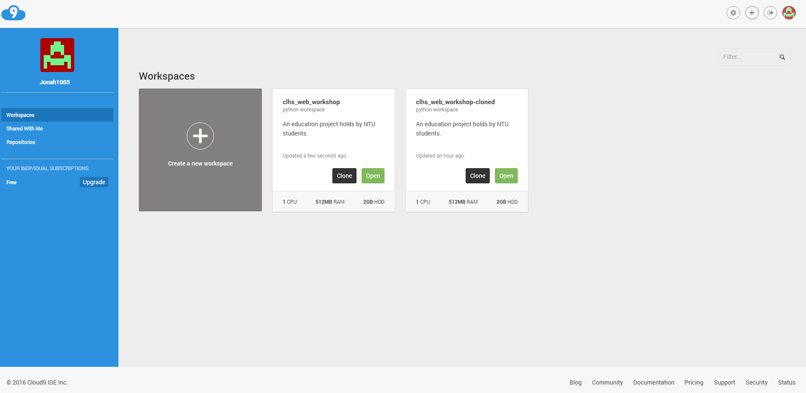
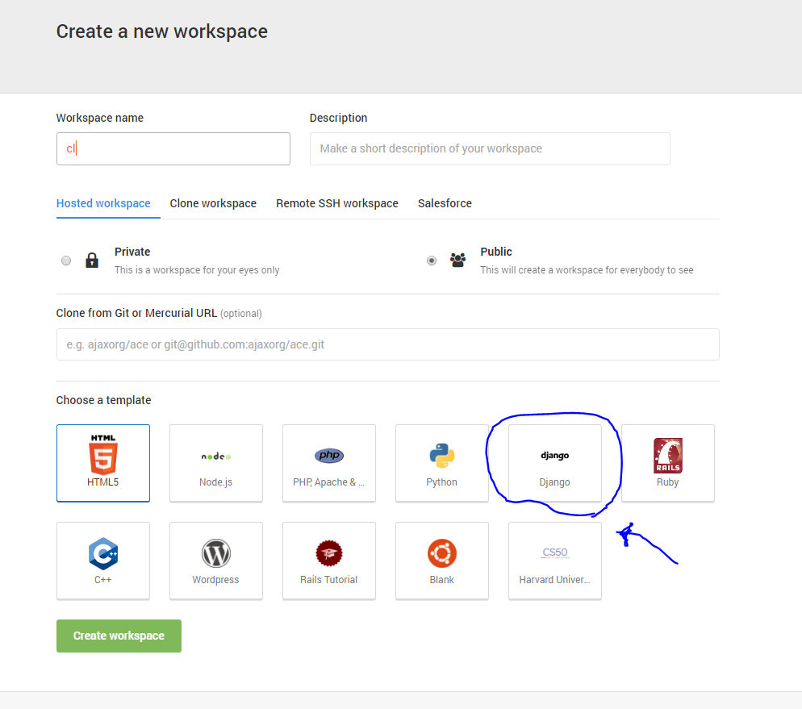
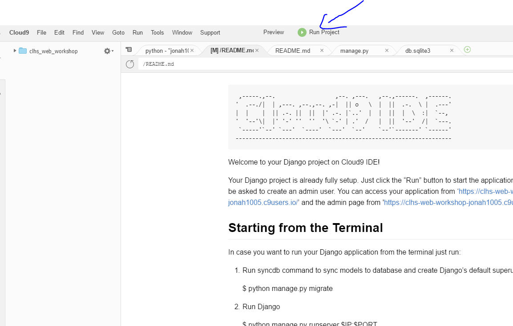

# [Cloud9](https://c9.io/?redirect=0)

這頁是註冊跟使用Cloud9的教學，反正就點進去照著網站的指示註冊帳號，然後開一個DJANGO的Project．如果已經會了可以直接下一頁．


* 進到[註冊網頁](https://c9.io/signup)填下一步，只要信箱填對剩下都不重要．之後再去收認證信，就完成了
* 接著按下create a new workspace
* 這一步WorkSpace name 跟 Description 不重要,就取個喜歡的名子就好.**不過template記得要選Django**
* 之後登入cloud9應該就看的到你的workspace了點open就可以進到我們的workspace了
* 進去之後可以直接點Run Project 你的網頁就已經跑起來了.這時候你去你的網址(可以打開README.md找 或是https://clhs-web-workshop-jonah1005.c9users.io/ 這是我的網址 ```jonah1005```是我的```username``` ```clhs-web-workshop```是我的```workspace```名稱自己換一下就可以了)就可以看到django的預設網頁至於要怎麼開始寫，就請待下回揭曉


~~~~~~~~~~~~~~~~~~~~
