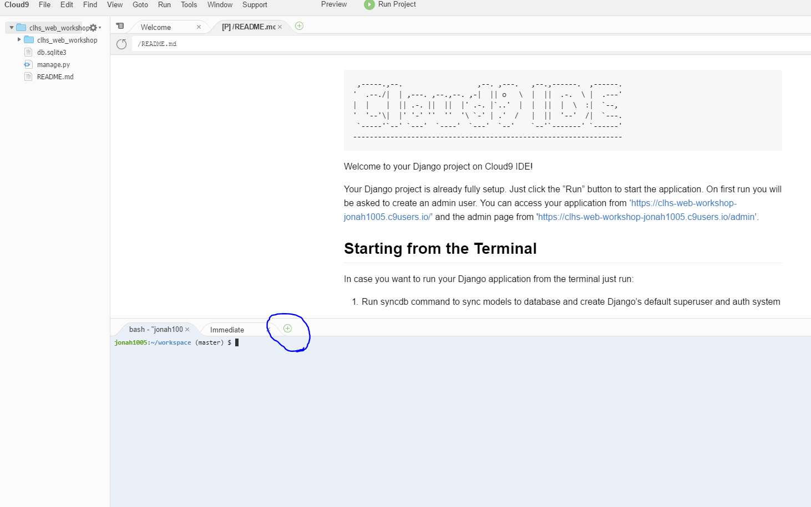
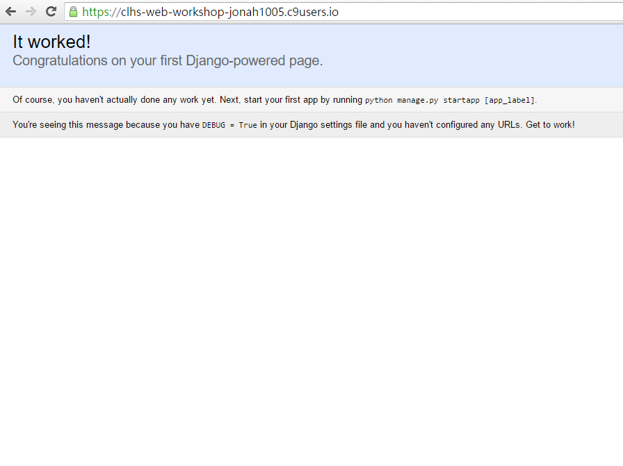
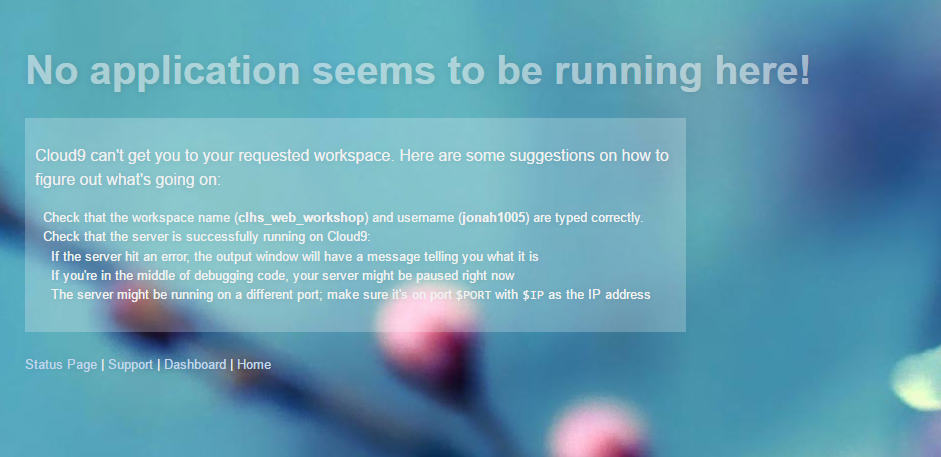

# 第一個專案

雖然按Run Project，我們就可以開始跑後臺的server，但是Django原本的設計是透過command line來操作的，我們不要被侷限在cloud9裡面，所以我們盡可能的使用command line，第一次聽到command line沒關係，你會越來越熟悉的**.所以如何在cloud9使用command line呢?**

打開你的專案之後,下面預設就是有Terminal,就可以下任何你想要的指令.如果沒看到,或是不小心把它關掉了,就按旁邊那個+選New Terminal那又會出來了.任何電腦上的功能都可以透過這個Terminal操作.要怎麼用請看[鳥哥的Linux私房菜](http://linux.vbird.org/linux_basic/redhat6.1/linux_06command.php)，不過不用緊張，Django會用到的指令就是那幾種，會慢慢介紹。

## 用Command Line跑起我的網站
首先先確定目前的位址是在```jonah1005:~/workspace (master) $ ```
  如果不是,可以用cd回到workspace.```cd Path```是回到 Path的意思。先用 ls可以檢查現在的位置有哪些東西,如果他是資料夾,就可以透過cd進到那個資料夾，這時候你command line左邊那個位址就會變了。要回到上一層要打 ```cd ..```先熟悉一下這兩個指令吧，之後會很常用到這兩個。
  
  然後我們再workspace 執行這個command ```python manage.py runserver 0.0.0.0:8080```，按下Enter之後，打開我們的網站了!這時候在連上我的網址，（每個人不一樣，我的是https://clhs-web-workshop-jonah1005.c9users.io/ ）就可以看到原本那個Django的預設網頁了。

我們現在簡單的解說一下剛剛那個command在幹嘛好了,首先```python```代表我要用pyton執行後面的指令,還記得Django就是用python寫的嗎?所以我要執行Django就要用python,```manage.py```就是django這個框架(程式),你如果把她打開可以看到很多複雜的程式碼,但是我們現在不用看懂他的程式碼,只要會用就好了。```runserver 0.0.0.0:8080```這個是你給django的指令，runserver顧名思義就是要把server架起來，那後面的0.0.0.0:8080代表什麼呢？

還記得我們說過後端就像老師嗎？([回去複習](../frontend_vs_backend.md))那這個老師要去哪裡等學生呢?就是在0.0.0.0:8080. 0.0.0.0代表我要listen所有IP(就是說這個老師看到有學生,就會讓它進來教室,如果這邊換成你特定ip,那就只有那個人可以連到這個網站).8080代表我在聽這個port,port是什麼?詳情請看[維基百科](https://zh.wikipedia.org/wiki/TCP/UDP%E7%AB%AF%E5%8F%A3%E5%88%97%E8%A1%A8)。也可以想成是很多條路，今天你要去學校，可以走A路，也可以走B路。今天我要在8080號這條路的路口等學生，那學生就要從這條路進來才看的到我.

我們可以案Ctrl+C先停掉我的server 然後再用這個指令```python manage.py runserver 0.0.0.0:8081```現在老師變成在8081號路口等了,這時候你如果再想連到你的網頁https://clhs-web-workshop-jonah1005.c9users.io/你看到的應該是

這代表你你找不到你的server,cloud9還很貼心的還送你一個漂亮的網頁.我們只要在網址後面加個port名子就可以了.https://clhs-web-workshop-jonah1005.c9users.io:8081  就可以回到我們的網頁了

其實正常網頁的預設port應該是80(Http )，你只有打網址就是會連到port 80，不過cloud9的預設是8080.

我們現在已經能跑起server了，接下來就可以開始動手寫網頁了。
~~~~
