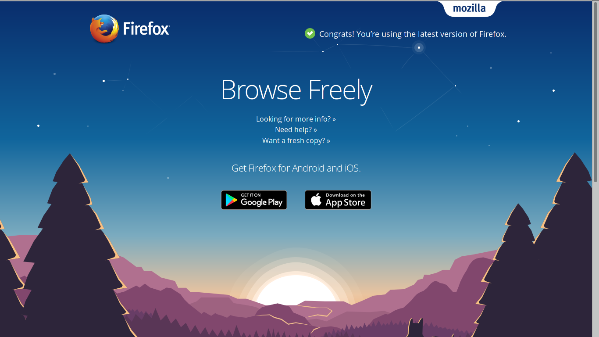

# CSS入門

## 什麼是 CSS

如果你有完成 html 的練習，你應該已經可以做出一個醜醜的網頁了。這時後再解釋什麼是 CSS 應該就容易得多了。

前面做出來的網頁各種元素的排列、外觀，都是依照預設的樣式，這時候我們就可以使用 CSS 指定某些元素要長什麼樣子，像是它們要是什麼顏色、大小有多大、要不要有邊框等等。

下面的圖片是 Firefox 官網的截圖，首先是原來的樣子



接著拿掉 CSS 以後


可以看到原來漂漂亮亮的網頁也變得很醜了。

那麼，具體而言 CSS 長什麼樣子呢？跟 html 一樣， CSS 只是一份有特殊格式的純文字檔，接下來就要介紹他的格式以及一些概念。

## CSS 的引用

要讓一個網頁使用一段 CSS 的規則有幾種方法，其中一個是在網頁除了`<html></html>`元素外頭以外的任何地方，像是`<body></body>`裡，加入一個 `<style></style>` 元素，然後 CSS 的內容就直接放在 `<style></style>` 的內容裡，像是如果你複製下面那段文字到你的 html 檔案裡，你應該要能夠看到一個紅色的標題。

```html
<style>
h1 {
    color: red;
}
</style>
<h1> Red Title </h1>
```

或著，更為常見的做法是加入一個`<link>`元素，像是這樣

```html
<link rel="stylesheet" href="./url/of/your/css/file">
```

其中 `href` 屬性就是你 CSS 檔案的 url。


## CSS 的格式

先來看看 CSS 固定的格式大概是長什麼樣子吧

```css
h1 {
    color: red;
}

.sea {
    color: blue;
}
```

一份 CSS 就是像這樣由很多

```
文字 {
   一或多行文字
}
```

的方塊組成的文件。其中 `{` 前的文字我們稱它為「選擇器」，而 `{` 、`}` 裡的文字則是一行又一行的樣式，決定了被前面選擇器「選到」的元素要長什麼樣子。
其中每一行都是「屬性（Property）:值;」這樣子格式，像是

```css
color: red;
```

這一行就是在指定 `color` 這個「屬性」的「值」是 `red`。需要注意的是，不要忘記每一行最後面的分號。

## 選取器（Selector）

前面說過「 CSS 可以用來指定『一些元素』的樣子」，可是一個網頁可以有非常多的元素，要如何表示特定的「某些元素」呢？這就是選取器概念的由來。

選取器並不是一種程式，也不是個機器，選取器就只是一小段文字，代表了一些規則，而滿足這些規則的元素，就算是被「選到」了，而被選到的元素就會套用選取器後`{}`裡的樣式。

以下介紹一些常見的選取器：
（更完整的表可以參考[這裡](https://developer.mozilla.org/en/docs/Web/Guide/CSS/Getting_started/Selectors)）
### 標籤選取器（Tag Selector）

這個選取器針對的是標籤的名稱，也就是元素的名稱來選取元素。例如，像下面這樣就可以選取所有`<h1></h1>`的元素。

```css

h1 {
   color: red;
}
```

也就是說，所有`<h1></h1>`的元素都會變成紅色的。

### 類別選取器（Class Selector）

其實每個元素都可以加上一個 `class` 屬性，而這個屬性的值就是類別的名稱了。像是這樣

```html
<span class='blue'>海藍藍的</span><br>
<span class='blue'>天也藍藍的</span>
```

上面的兩個 `<span>` 元素就都是 `blue` 這個類別了。

而類別選取器可以把所有屬於那個類別的元素選出來，像這樣

```css
.blue {
    color: #0000FF
}
```

而語法很簡單，就是 `.` 後面加上類別的名稱。


### 偽類別選取器（Psudo-Class Selector）

當一個元素進入某個特殊的狀態時，像是游標放在這個元素的上面時，一個「偽」類別就會被加到這個元素上。

以下列舉一些常見的偽類別

* `:hover` ：當游標在這個元素上時。
* `:checked`：一些可以被「選」的元素，像是 checkbox，被選取時。
* `:active`：通常是被按下去時。

而常見的用法則是例如：

```css
.blue:hover {
    color: #0000FF
}
```

即原來的選取器後加上偽類別選取器。

### 顏色的表達方式

在 CSS 中，顏色有幾種表達方式

* 文字：像是 red, blue, yellow 等
* \#000000：六個 0-9, A-F 的字元，每兩個代表一個 0 ~ 255 的數字，分別代表 Red, Green, Blue 的值。
* rgb(0, 0, 0)：三個參數分別是 Red, Green, Blue 的值，一樣也是 0 ~ 255 的數。
* rgba(0, 0, 0, 0.5)：同上，不過第四個數是透明度，是介於 0 ~ 1 的小數。

### 長度的單位

CSS 中有定義了很多種長度的單位，以下列舉一些常見的

* `em`: 一個相對於字體大小的單位。
* `%`: 相對於外面那層元素的百分比。
* `px`: 像素的大小。
* `cm`: 就是公分囉。

### 常見的屬性們

以下介紹一些常見的屬性

#### 文字顏色：color

先來個簡單的， color 可以指定文字的顏色，至於顏色的表示法則是參考上面。例如：

```css
h1: rgb(5, 5, 5);
```

**Exercise**: 試著讓 `<h2></h2>` 的元素，在游標移上去時會變成介於藍色和綠色之間的顏色。

#### 背景顏色：background-color

指定背景的顏色。

#### 長寬：width, height

你可以用 `width`, `height` 屬性決定一些元素的長寬。

#### 定位：top, bottom, left, bottom, position

CSS 還可以透過 top, bottom, left, bottom 指定元素的位置。

至於定位的方式則是由 position 決定，以下介紹幾種定位的方式

* `relative`：相對於原本的位置。
* `absolute`：相對於外層有定位的元素。例如：若 A 元素是 B 元素的子元素，而 B 元素有定位，則 A 的位置是相對 B 元素。
* `fixed`: 相對於螢幕，所以可以讓一個元素不會隨著頁面的往下拉而跑掉。

你可以在[這裡](https://btp-code.github.io/btp-code/css/examples/position.html)看看效果。

**Exercise**：讓 `<nav></nav>` 這個元素固定在頁面的最上方，寬度必須跟螢幕一樣，並且不會隨頁面的滾動移動，背景不能是白色。

#### 顯示方式：display

決定要如何顯示一個元素，有幾種選項

* `none`：不顯示
* `inline`：行內的元素，或著說像是一個句子。不能指定它的長寬。
* `block`：可以指定長寬。
* `inline-block`：可以指定長寬。有點像是「與文字排列」的感覺。


**Exercise**：到[這裡](https://btp-code.github.io/btp-code/css/examples/display.html) 看看以上四種屬性的`<div></div>`元素與文字排列的情形。

#### Box model 

你可以指定一個 display 屬性是 block 或 inline-block 的元素

* 邊框（border, border-style）
* 邊框寬度（border-width）
* 元素外留白的寬度（margin）
* 元素內留白的寬度（padding）

**Exercise**：到 [這裡](https://btp-code.github.io/btp-code/css/examples/box.html) 用 <kbd>Ctrl</kbd> + <kbd>Shift</kbd> + <kbd>c</kbd> 觀察看看這些 box 們。


#### Overflow 

`overflow` 屬性指定當元素的內容「滿出來」的時候應該要把多出來的部分藏起來、直接顯示或是讓內容可以上下捲動。

`overflow-x`, `overflow-y` 則是分別指定元素內容朝 x, y 軸「滿出來」的狀況。

可以在[這裡](https://btp-code.github.io/btp-code/css/examples/overflow.html)看看效果以及範例。


#### 漸層背景
    
也可以指定背景為漸層，主要用法像是這樣：

```css
    background: linear-gradient(to right, red, blue);
```

或是：

```css
    background: radial-gradient(circle at 5% 5%, red, yellow, blue);
```

以 `linear-gradient` 而言，第一個參數是方向，也可以使用度數如`45deg`表示。接下來則是顏色，可以有不只兩個，也可以在顏色後面加上比例，如`red 50 %`。

而 `radial-gradient` 的第一個參數則是 `ellipse length-x length-y at x y`， `length-x`, `length-y` 分別是橢圓 x, y 軸的長度， `x`, `y` 則是圓心的位置。

可以在[這裡](https://btp-code.github.io/btp-code/css/examples/gradient.html)看看效果以及範例。


#### transition

對於一些屬性，可以透過 `transition` 指定他們漸漸改變的速度，而不是直接改變。

例如在[這個例子](https://btp-code.github.io/btp-code/css/examples/transition.html)中，`div` 這個元素被設定了

```css
    transition: width 1s, height 1s;
```

因此在 `:hover` 改變 `div` 的長寬時， `div` 會慢慢的放大。

#### @media

為了適應不同的螢幕大小，我們可以用 `@media (條件){ CSS 規則 }` 這個語法來讓 `{}` 裡的 CSS 規則在滿足 `()` 裡的條件時才有效。常用的條件有

* max-width： 螢幕寬度上限，亦即只在螢幕寬度不超過指定的值時，`{}` 裡的 CSS 才會有效。
* max-height： 螢幕高度上限，亦即只在螢幕高度不超過指定的值時，`{}` 裡的 CSS 才會有效。
* min-width： 螢幕寬度下限，亦即只在螢幕寬度不少於指定的值時，`{}` 裡的 CSS 才會有效。
* min-height： 螢幕高度下限，亦即只在螢幕高度不少於指定的值時，`{}` 裡的 CSS 才會有效。

例如在這個[例子](https://btp-code.github.io/btp-code/css/examples/media.html)中，使用了

```css         
         @media (max-width: 300px){
             .small {
                 display: inline;
             }
         }

         @media (min-width: 400px){
             .big {
                 display: inline;
             }
         }        
```

讓頁面上的文字會隨螢幕寬度而改變。

註：你可能會需要在 `<head></head>` 加上

```html
<meta name="viewport" content="width=device-width, initial-scale=1">
```

@media 的效果才能在行動裝置上正確運作。

#### 更多

事實上還有非常非常多，某些特定的元素還有某些特定的屬性，[這裡](https://developer.mozilla.org/en-US/docs/Web/CSS/Reference)有一張更完整的表。


#### 使用別人寫好的 CSS

在實務上，網路上已經有許多別人寫好讓大家自由使用的 CSS 了，這些已經寫好的 CSS 再加上一些 Javascript 便形成了一個我們稱之為「框架（Framework）」，例如後面出現的「[偽組合語言直譯器](https://btp-code.github.io/btp-code/psudo-assembly-interpreter/)」就是使用了幾乎是最知名的前端框架 [Bootstrap](http://getbootstrap.com/)。利用這些框架，我們可以快速的打造出美觀並同時適合桌面裝置與行動裝置的網頁。除了 Bootstrap 以外，其他有名的框架還有

* [Material Design Lite](https://getmdl.io/)： Google 提供的 Material Design 實作，雖然沒有像 Bootstrap 這麼完整，但算是我個人認為最容易上手的。
* [Semantic UI](http://semantic-ui.com/)：看起來很潮，值得一試。
