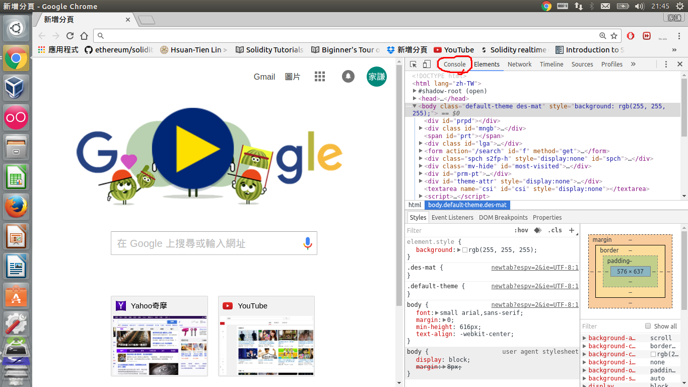
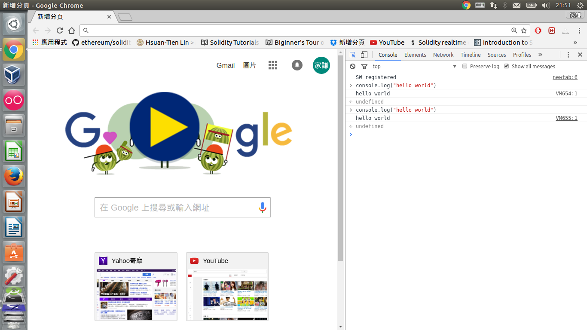
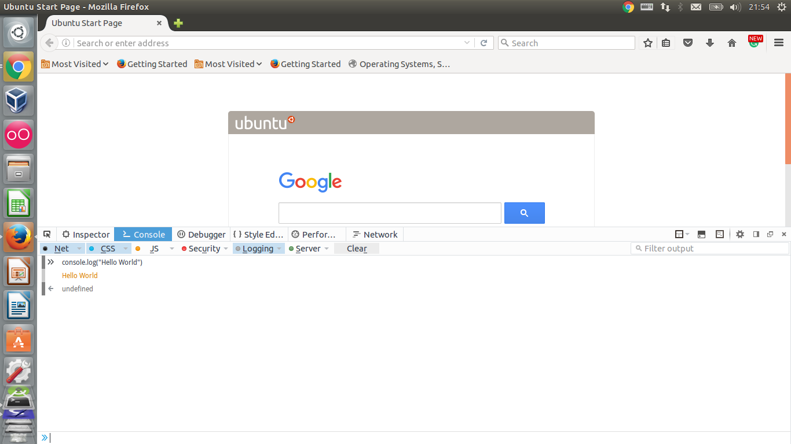

# 環境介紹
此教學會選用javascript作為第一個程式語言最大的原因就是javascript的直譯器內建在瀏覽器裡，換句話說，只要有瀏覽器的電腦就可以開始練習javascript。

在這裡為大家介紹兩種瀏覽器。
##chrome 
按F12之後進入開發者模式，會跳出一個視窗，找到console。

```console.log("hello, world")```


##FireFox
跟Chrome一樣，按F12後進入開發者模式，找到console。


##hello, world
```console.log()```
是讓console印出你要的東西。要注意的是，hello, world要用雙引號（或是單引號）包住。
[^1]

[^1]: 
印出hello, world在程式設計中的習慣，作為解釋或學習任何一個程式語言的第一個程式。人們相信第一個hello， world程式是1972年__Brian Kernighan__的書book__A Tutorial Introduction to the Language B__，而他在1974年的書__Programming in C: A Tutorial__沿用了hello, world程式作為第一之程式，從此被廣泛的使用，變成一種學習程式語言的傳統。
